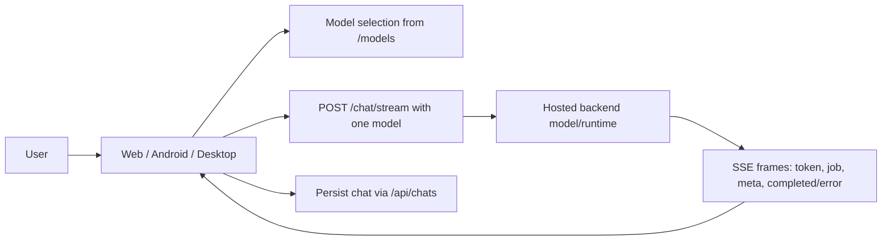
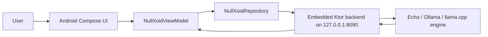
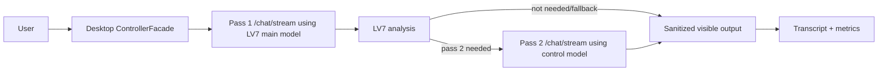
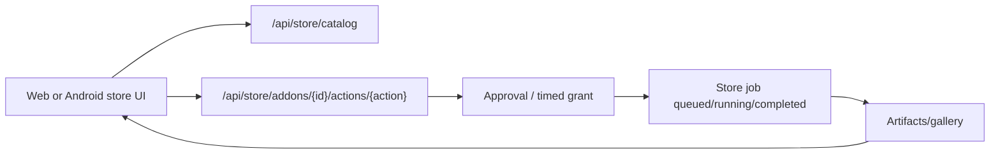

# Elabs Suite Service And Pipeline Map

This map is based on the current source under the operator's suite workspace and is the source-of-truth architecture map during the stabilization pass.

## Locked Product Map

| Product / module | Current repo or surface | Ownership meaning |
| --- | --- | --- |
| Elabs Suite | Cross-repo suite | The whole product family. |
| Elabs | `NullXoid-live` | Web shell / lab interface. |
| NullXoid / NullXoid Chat | Web, Android, Desktop chat surfaces | Assistant identity and default chat app. |
| CoreEcho | Hosted/backend contracts plus embedded route mirrors | Auth, users, workspaces, projects, chats, permissions, settings. |
| RuntimeEcho | `/models`, `/api/llms/*`, `/api/ollama/*` compatibility, desktop router | Model inventory, provider routing, model eligibility, LV7 hooks. |
| VaultEcho | Saved chats, artifacts, gallery, E2EE flows | Memory, encrypted persistence, attachments, generated artifacts. |
| AddonEcho | Store/catalog and add-on manifests | Install state, permissions, route/intent availability. |
| StudioEcho | Store/media routes and Comfy/local media jobs | Image, video, and 3D workflows. |
| Command Center Codex | CCC/Codex panels | Coding workspace and GitHub/project control flows. |
| Canvas | Canvas/Codex preview surfaces | Display/playback/preview panel, usually inside CCC. |
| BridgeEcho | NullBridge/bridge routes | Admin console and service-to-service route policy. |
| AIBenchie | `AIBenchie` plus surfaced verdicts | External validation and release gates. |
| LV7 | Desktop runtime | Experimental two-pass mode only. |

## System Surfaces

| Surface | Repo | Role | Main entrypoints |
| --- | --- | --- | --- |
| Web app / PWA | `NullXoid-live` | Browser UI for chat, model selection, settings, artifacts, media workflows, saved chats, CCC, Codex canvas, auth/admin | `src/apps/nullxoid/hooks/useNullxoidAppController.js`, `usePromptExecution.js`, `useChatExecution.js`, `controller/intent_controller.js` |
| Android app | `NullXoidAndroid` | Native Compose frontend, hosted API client, embedded backend host, local store/gallery/jobs, Android passkeys/OIDC, E2EE saved-chat handling | `ui/NullXoidViewModel.kt`, `data/repo/NullXoidRepository.kt`, `data/api/NullXoidApi.kt`, `backend/routes/Routes.kt` |
| Desktop app | `AiAssistant` | Qt desktop shell, bridge-first client, LV7 controls/runtime, CCC/canvas, backend model and chat bridge | `src/system/controller/controller_facade.cpp`, `src/bridge/nullxoid_backend_bridge.cpp`, `src/system/runtime/level7_runtime.cpp` |
| NullBridge | `NullBridge` | Service-mesh, approval, trust policy, capability routing, backend/node registry, signed envelope and notification bridge | `backend/scripts/nullbridge_api.py`, `backend/infra/nullbridge/*.json`, `backend/scripts/nullbridge_auth.py` |
| AIBenchie | `AIBenchie` | Validation/benchmark/release gate tooling for hosted stack, chat stream, NullBridge, security/privacy, Android and wrapper contracts | `aibenchie_local.py`, `aibenchie/hosted_nullxoid_chat.py`, `aibenchie/suite_test_catalog.py` |

## Shared Backend Contract

The frontends largely converge on the same hosted/backend contract:

| Endpoint family | Purpose | Used by |
| --- | --- | --- |
| `/auth/*` | Login, logout, current user, passkey/OIDC where supported | Web, Android, desktop |
| `/health/features` | Feature flags, runtime identity, enabled capabilities | Web, Android, desktop |
| `/models` | Backend model inventory compatibility route | Web, Android, desktop |
| `/api/llms/*` | RuntimeEcho provider/model/profile shape for Ollama, llama.cpp, hosted, OpenAI-compatible, local Echo | Web, Android embedded, future hosted runtime |
| `/chat/stream` | SSE chat/model streaming. Normal chat sends one `model` field. | Web, Android, desktop, AIBenchie checks |
| `/api/chats*` | Saved chats, archived chats, project/workspace scoped chat storage | Web, Android, desktop |
| `/api/settings*` | LLM/runtime/settings sync | Web, Android, desktop |
| `/artifacts*`, `/vision/context` | Uploads, recent artifacts, previews, vision metadata | Web, Android store/gallery, desktop canvas |
| `/api/store/*` | Creative workflow catalog, approval-gated image/video/3D jobs, gallery/jobs | Web, Android, desktop adapter/tests |
| `/api/ollama/*` | Compatibility model-management routes while RuntimeEcho migrates to `/api/llms/*` | Web, desktop |

## Web Pipeline

Normal web chat:

1. `useNullxoidAppController` wires auth, settings, models, chat state, artifacts, media, voice, and panels.
2. `usePromptExecution.sendPrompt` builds the final prompt, system prompt, history, attachments, workspace/project/chat IDs, and selected model.
3. `controller/intent_controller.js` classifies intent:
   - `chat`
   - `vision_describe`
   - `codex`
   - `batch_media`
   - `comfy_image`, `comfy_video`, `comfy_3d`
4. `executeTask` dispatches:
   - chat/vision/codex final text path -> `runChatTask`
   - media intent -> `runComfyTask` or `runBatchTask`
5. `useChatExecution.runChatTask` sends `POST /chat/stream` with:
   - `model`
   - `messages`
   - `attachments`
   - `workspace_id`, `project_id`, `chat_id`
   - routing flags like `allow_inline_calls`, `access_level`, `reasoning`
6. SSE frames update assistant text, thinking blocks, artifact cards, stream status, and recent artifact refresh.

Web model behavior:

- `useModelManager` loads `/models`.
- `useRuntimeConfig` resolves `defaultChatModel` from `llm.default_model` then `llm.router_model`, falling back to first chat-capable model.
- `llm.heavy_model` and router/heavy settings exist in UI/config, but current normal chat sends one selected `model`.

## Android Pipeline

Hosted Android chat:

1. `NullXoidViewModel` owns UI state.
2. `NullXoidRepository` is the single data boundary for hosted/embedded API calls.
3. `NullXoidApi` covers typed JSON routes for auth, models, settings, chats, store, health.
4. `ChatStream` sends `POST /chat/stream` and parses SSE frames into `StreamEvent`.
5. `sendMessageInternal` appends the user message locally, creates a backend chat if needed, calls `repo.streamReply`, then persists the final assistant response through encrypted saved-chat update.

Android embedded backend:

1. `BackendService` starts a foreground service on `127.0.0.1:8090`.
2. `EmbeddedServer` installs routes from `backend/routes/Routes.kt`.
3. Engine selection is from `SettingsStore.embeddedEngine`:
   - `echo` -> `EchoEngine`
   - `ollama` -> `OllamaEngine`, relays to `{ollamaUrl}/api/chat`
   - `llamacpp` -> `LlamaCppEngine`, relays to `{baseUrl}/v1/chat/completions`
4. Embedded `/models` exposes the active engine as one chat/streaming model.
5. Embedded `/chat/stream` ignores any second-pass concept and calls one `LlmEngine.generate`.

Android model behavior:

- The app stores one selected model in DataStore.
- Current selection logic filters out non-text chat models such as `vl`, vision, embedding, image/video, TTS/STT before preserving or auto-selecting a model.
- Android does not implement LV7 pass-2/control-model routing.

## Desktop Pipeline

Normal desktop chat:

1. `ControllerFacade::sendMessage` appends user message and calls `startGenerationForLastUserMessage`.
2. `effectiveModel()` resolves backend default/manual override or LV7 profile model when active.
3. `beginStreaming` builds `ChatRequest` with one `model`, transcript, chat/workspace/project context, runtime flags.
4. `beginBackendRequest` calls `NullXoidBackendBridge::startRequest`.
5. `NullXoidBackendBridge` posts to `/chat/stream`, parses SSE, emits chunks/jobs/completion/failure.
6. Controller updates session, local cache, remote chat, event bus, UI state.

Desktop LV7 path:

- Legacy/normal mode uses one model.
- Active LV7 mode uses pass 1 with the LV7 main model.
- If LV7 analysis requires pass 2, `startLevel7Pass2` sends a second `/chat/stream` request with the LV7 control model.
- Pass-2 timeout/failure/cancel falls back to sanitized pass-1 output.
- LV7 metrics, manual scores, activation/rollback/burn-in/startup-default state are desktop-local.

Desktop adapters:

- `NullXoidBackendBridge`: hosted/backend contract.
- `OllamaModelAdapter`: direct local Ollama test/adapter path.
- `NullBridgeServiceAdapter`: service-mesh integration surface.
- `ElabsStoreAdapter`: store/media workflow integration.

## NullBridge Pipeline

NullBridge is not the normal chat UI backend. It is the policy/service bridge for backend-to-backend and tool/capability routing.

Core pieces:

- `backend/scripts/nullbridge_api.py`: HTTP API, auth, route checks, envelopes, approvals, notifications.
- `backend/scripts/nullbridge_auth.py` and `nullbridge_auth_store.py`: device sessions, pairing/enrollment, refresh, revocation.
- `backend/infra/nullbridge/backend-registry.json`: trusted backend identities and capabilities.
- `backend/infra/nullbridge/node-registry.json`: nodes/participants.
- `backend/infra/nullbridge/route-policy.json`: allowed capability routes and approval requirements.
- `backend/infra/nullbridge/trust-policy.json`: trust constraints.

Typical NullBridge route:

1. Caller authenticates as a trusted backend/service or paired device.
2. Caller submits route check/envelope with capability, target role/node, payload, and context.
3. NullBridge validates identity, route policy, node/backend registry, and capability.
4. If approval is required, it creates pending approval/grant state.
5. If approved or already covered by a timed grant, the request is routed/recorded.
6. Audit/observability records are appended with redaction and lifecycle state.

NullBridge capabilities seen in this suite include:

- `chat.stream`
- `models.ollama.manage`
- `suite.media.image.generate`
- `suite.media.video.generate`
- `suite.media.model3d.generate`
- `notifications.publish`
- `notifications.subscribe`

## AIBenchie Pipeline

AIBenchie is a validation and benchmark harness, not an app runtime.

Major paths:

- Local Ollama benchmark: `local_ollama.py` lists `/api/tags` and calls `/api/generate`.
- Hosted auth check: `hosted_nullxoid_auth.py`.
- Hosted chat check: `hosted_nullxoid_chat.py` logs in, discovers models/context, posts `/chat/stream`, validates SSE/output and route hygiene.
- Ephemeral hosted chat: creates short-lived test user, runs hosted chat, then cleanup.
- Hosted stack check: verifies broader hosted route availability and JSON/HTML challenge boundaries.
- NullBridge local runner: starts NullBridge locally, exercises trust/approval/route paths.
- Suite gates: security, privacy, generated-output policy, resource budgets, release artifacts, public scoreboard.

## End-To-End Flows

### Text Chat, Hosted Backend

### Android Embedded Chat

### Desktop LV7 Chat

### Media Workflow

## Known Risk Areas

- Model selection must not preserve unsuitable models for text chat. Android now filters `vl`/vision/embed/media models; web should be reviewed for the same edge case.
- Hosted `/models` ordering should not be trusted as a user-facing default.
- `router_model`/`heavy_model` settings exist in web config but normal chat currently uses one `model`; if true two-model routing is desired, it needs explicit backend and frontend ownership.
- Desktop LV7 is the only current first-class two-pass chat path.
- Android embedded `llamacpp` is a relay to an external llama.cpp server, not an in-app native GGUF runner.
- NullBridge approval/grant state is separate from the normal `/chat/stream` path and should not be conflated with the chat backend.

## Source Anchors

- Web routing: `NullXoid-live/src/apps/nullxoid/controller/intent_controller.js`
- Web chat stream: `NullXoid-live/src/apps/nullxoid/hooks/useChatExecution.js`
- Web runtime/model selection: `NullXoid-live/src/apps/nullxoid/hooks/useRuntimeConfig.js`, `useModelManager.js`
- Android app state: `NullXoidAndroid/app/src/main/java/com/nullxoid/android/ui/NullXoidViewModel.kt`
- Android API boundary: `NullXoidAndroid/app/src/main/java/com/nullxoid/android/data/repo/NullXoidRepository.kt`
- Android embedded routes: `NullXoidAndroid/app/src/main/java/com/nullxoid/android/backend/routes/Routes.kt`
- Android engines: `EchoEngine.kt`, `OllamaEngine.kt`, `LlamaCppEngine.kt`
- Desktop controller: `AiAssistant/src/system/controller/controller_facade.cpp`
- Desktop backend bridge: `AiAssistant/src/bridge/nullxoid_backend_bridge.cpp`
- Desktop LV7 runtime: `AiAssistant/src/system/runtime/level7_runtime.cpp`
- NullBridge API: `NullBridge/backend/scripts/nullbridge_api.py`
- NullBridge policy: `NullBridge/backend/infra/nullbridge/route-policy.json`
- AIBenchie CLI: `AIBenchie/aibenchie_local.py`
- AIBenchie hosted chat: `AIBenchie/aibenchie/hosted_nullxoid_chat.py`
